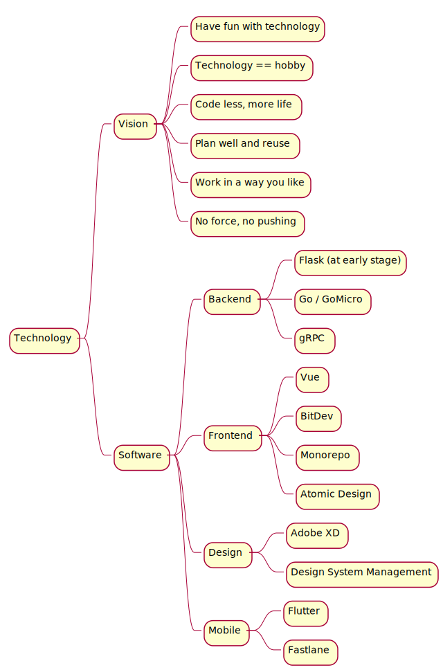
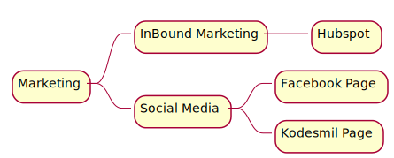
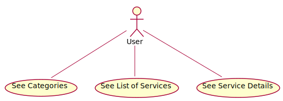
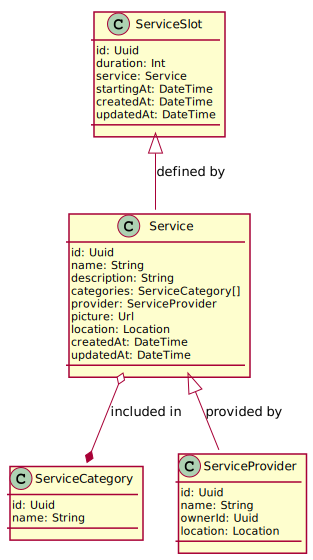
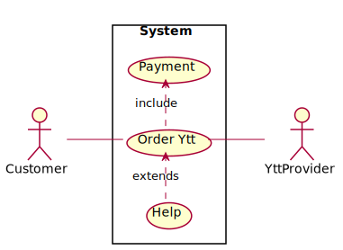
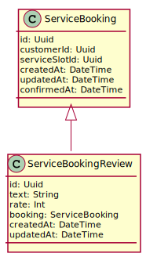
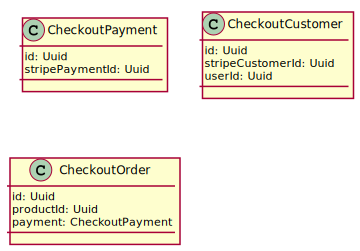
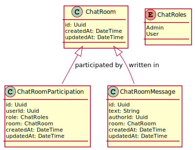
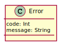

# Kodesmil

## Technology Guideline

### Manifests
- https://reactivemanifesto.org/
- https://agilemanifesto.org/
- https://remoteonly.org/

## Marketing

## Products

# Ytt

## Authentication (Auth0)

### Classes

## Content Serving

### Use Cases

### Classes

## Booking 

### Use Cases

### Classes

## Payments

### Classes

## Chat

### Classes

## Error Handling

### Classes

