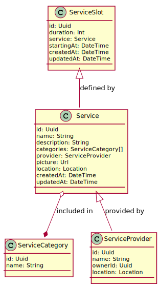

# Ytt

## Authentication (Auth0)

### Classes

## Content Serving

### Use Cases

### Classes

## Booking 

### Use Cases

### Classes

## Payments

### Classes

## Chat

### Classes

## Error Handling

### Classes

