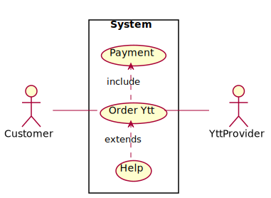
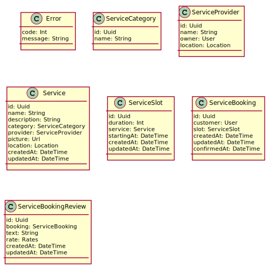
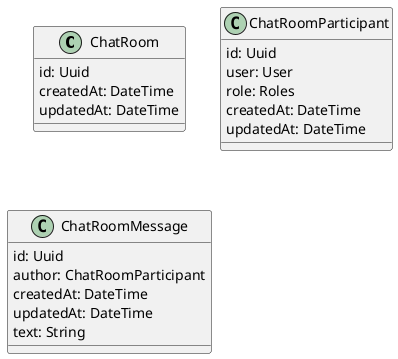
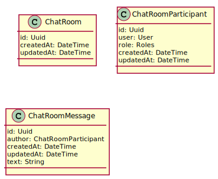

# Ytt

## Use case diagrams

```plantuml:ytt-cases
@startuml
left to right direction
skinparam packageStyle rectangle
actor Customer
actor Ytt Provider
rectangle System {
  Customer -- (System)
  (Order Ytt) .> (Payment) : include
  (Help) .> (Order Ytt) : extends
  (Order Ytt) -- Ytt Provider
}
@enduml
```


## Class diagrams

### Ytt Service

```plantuml:ytt-service-classes
@startuml

class Error {
  code: Int
  message: String
}

class User {
  id: Uuid
  firstName: String
  lastName: String
  email: String
  passwordHash: String
}

class ServiceCategory {
  id: Uuid
  name: String
}

class ServiceProvider {
  id: Uuid
  name: String 
  owner: User
  location: Location
}

class Service {
  id: Uuid
  name: String
  description: String
  categories: ServiceCategory[]
  provider: ServiceProvider
  picture: Url
  location: Location
  createdAt: DateTime
  updatedAt: DateTime
}

Service o--* ServiceCategory : included in
Service |-- ServiceProvider : provided by

class ServiceSlot {
  id: Uuid
  duration: Int
  service: Service
  startingAt: DateTime
  createdAt: DateTime
  updatedAt: DateTime
}

ServiceSlot |-- Service : defined by

class ServiceBooking {
  id: Uuid
  customer: User
  slot: ServiceSlot
  createdAt: DateTime
  updatedAt: DateTime
  confirmedAt: DateTime
}

ServiceBooking |-- ServiceSlot : booked for
ServiceBooking o-- User : booked by

class ServiceBookingReview {
  id: Uuid
  booking: ServiceBooking
  text: String
  rate: Rates
  createdAt: DateTime
  updatedAt: DateTime
}


@enduml
```


### Chat Service


